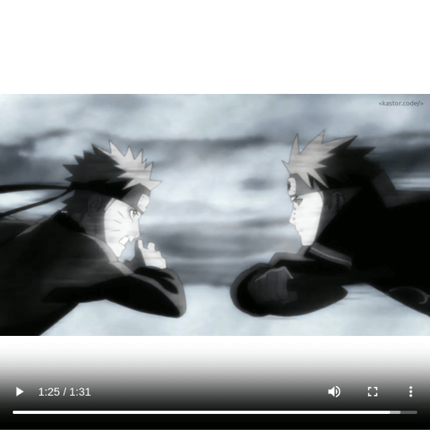

## Editing Videos with Node.js and FFmpeg

> 👷 Developed by Matheus Ramalho de Oliveira  
🔨 Brazilian Software Engineer  
🏡 Goiânia, Goiás, Brasil  
✉️ kastorcode@gmail.com  
👍 [instagram.com/kastorcode](https://instagram.com/kastorcode)

---

  This code edits and consumes video on demand using <a href="https://nodejs.org" target="_blank">Node.js</a> <a href="https://nodejs.org/api/stream.html" target="_blank">streams</a> and the <a href="https://ffmpeg.org" target="_blank">FFmpeg</a> library.

---

### Screenshot

  

---

### Installation and execution

Backend

1. Make a clone of this repository;
2. Open the backend folder in a terminal;
3. Run `yarn start` to start the server at port `3000`.

Frontend

1. Open the frontend folder in a terminal;
2. Run `yarn` to install dependencies;
3. Run `yarn start` to start http server at `http://localhost:8080`.

Video

1. Place a video in the `backend/videos` folder;
2. Rename the video to `input.mp4`;
3. Open the folder in a terminal;
4. Run the `./prepare.sh` script to generate the `output.mp4` video.

---

  <big><b>&lt;kastor.code/&gt;</b></big>

